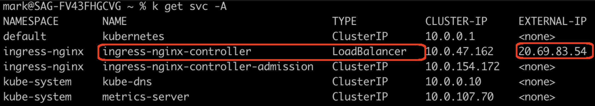
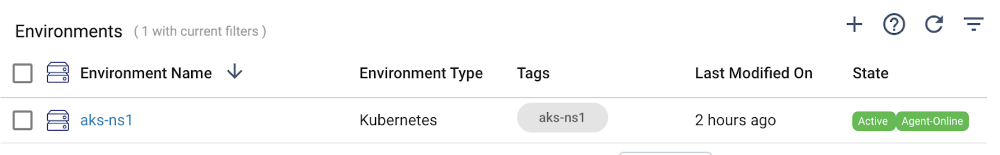
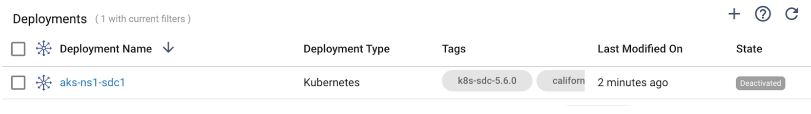
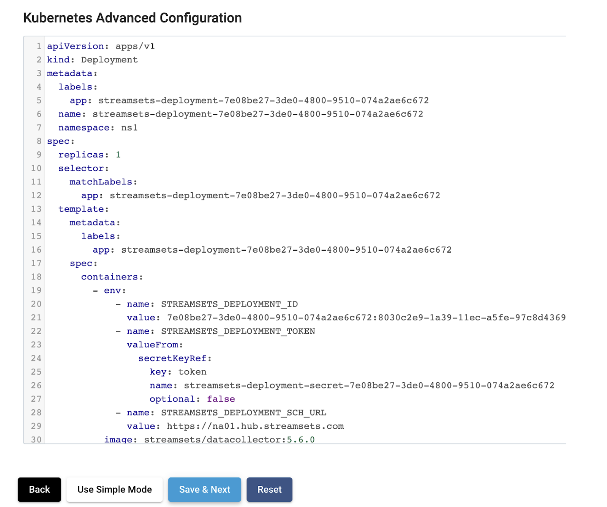
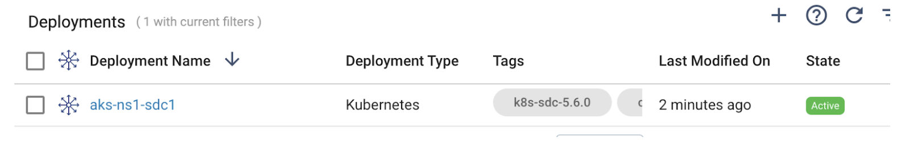
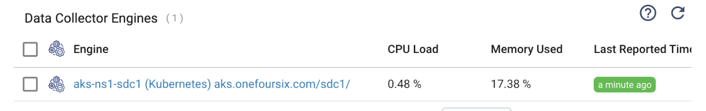
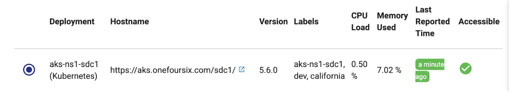
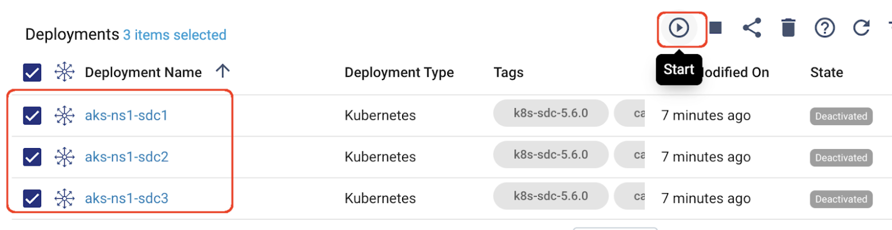
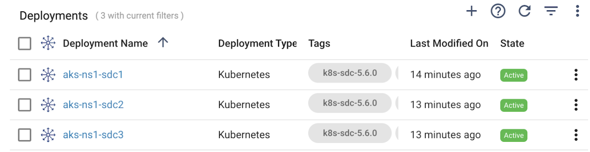
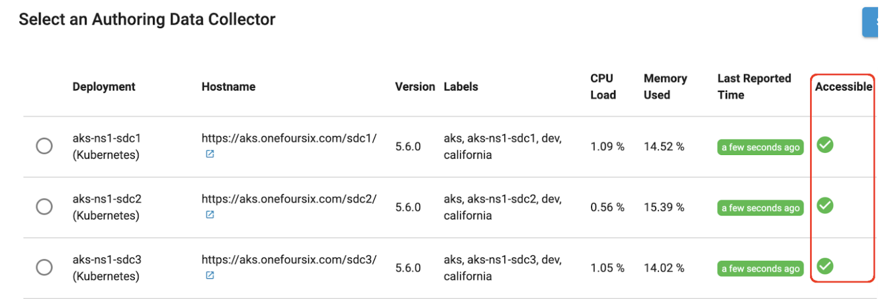

## StreamSets SDK Kubernetes Deployment Example with Ingress
This project provides an example of how to use the [StreamSets Platform SDK](https://docs.streamsets.com/platform-sdk/latest/index.html) to programmatically create a [Kubernetes Deployment](https://docs.streamsets.com/portal/platform-controlhub/controlhub/UserGuide/Deployments/Kubernetes.html#concept_ec3_cqg_hvb) of [Data Collector](https://streamsets.com/products/data-collector-engine/) (SDC) using an Advanced Kubernetes configuration (as described in Step 2 [here](https://docs.streamsets.com/portal/platform-controlhub/controlhub/UserGuide/Deployments/Kubernetes.html#task_xvp_g1n_jvb)) that includes a Kubernetes Service and Ingress, with HTTPS-based access to the deployed Data Collectors.  This approach may be necessary if [Direct REST APIs](https://docs.streamsets.com/portal/platform-controlhub/controlhub/UserGuide/Engines/Communication.html#concept_dt2_hq3_34b) must be used rather than [WebSocket Tunneling](https://docs.streamsets.com/portal/platform-controlhub/controlhub/UserGuide/Engines/Communication.html#concept_hbg_fq3_34b).

### Prerequisites
- The StreamSets Organization should have WebSocket communication disabled

- An existing Kubernetes cluster with the ability to deploy an Ingress Controller. For this example I will use [ingress-nginx](https://kubernetes.github.io/ingress-nginx/deploy/) on Azure Kubernetes Service (AKS)

- [API Credentials]() for a user with permissions to create Deployments 

### Configuration Details
- This example assumes TLS will be terminated at the Load Balancer with backend communication to SDC Pods over http.  The example could easily be extended to support backend communication to SDC over https

- A custom https URL will be set in the engine's <code>sdc.base.http.url</code> property

- The engine's <code>http.enable.forwarded.requests</code> property will be set to <code>true</code>

- A Kubernetes Service and Ingress will be created for the Data Collector deployment

- Path-based routing will be configured for the Ingress

### Test Environment
- AKS using Kubernetes version v1.25.11 

- ingress-nginx version 1.6.4

- SDC version 5.6.0

### Create a Namespace for the StreamSets Deployments
Create a namespace for the StreamSets Deployment:

<code>$ kubectl create ns ns1</code>

Make that namespace the default:

<code>$ kubectl config set-context --current --namespace ns1</code>

### Deploy the Ingress Controller
I installed ingress-nginx v1.6.4 on AKS using the command:

<code>$ kubectl apply -f https://raw.githubusercontent.com/kubernetes/ingress-nginx/controller-v1.6.4/deploy/static/provider/cloud/deploy.yaml</code>

### Get the External IP for the Ingress Controller's Load Balancer Service



### Map a DNS Name to the Load Balancer's IP
I added a record to my DNS to map the name <code>aks.onefoursix.com</code> to the Load Balancer's external IP, and confirm that using nslookup:

	$  nslookup aks.onefoursix.com
	Server:	8.8.8.8
	Address:	8.8.8.8#53

	Non-authoritative answer:
	Name:	aks.onefoursix.com
	Address: 20.69.83.54

### Store a TLS key and cert for the Load Balancer in a Secret
I'll use a wildcard cert and key for <code>*.onefoursix.com</code> in the files tls.crt and tls.key respectively. Store the TLS key and cert in a Kubernetes Secret:

	$ kubectl create secret tls streamsets-tls \
    	--key ~/certs/tls.key --cert ~/certs/tls.crt


### Create a Kubernetes Environment
Create a new Kubernetes Environment named <code>aks-ns1</code> and set the namespace to <code>ns1</code>. Activate the Environment but do not play the generated shell command; instead, click the <code>View Kubernetes YAML</code> button. In the dialog that opens, click the <code>copy</code> button. Paste the text into a text document on your local machine named <code>agent.yaml</code> (the name is not critical).

#### Edit the generated YAML for the Agent
On or around line 21, replace this line:

    resources: ["pods"]

with this line:

	resources: ["pods", "services"]

And add this new section:

```
- apiGroups: ["networking.k8s.io"]
  resources: ["ingresses"]
```

That change will allow the Kubernetes Agent to create Service and Ingress resources

The updated rules section in the Role resource should look like this:

```
rules:
  - apiGroups: [""]
    resources: ["pods", "services"]
    verbs: ["get", "list", "create", "patch", "delete"]
  - apiGroups: ["networking.k8s.io"]
    resources: ["ingresses"]
    verbs: ["get", "list", "create", "patch", "delete"]
  - apiGroups: [""]
    resources: ["secrets"]
    verbs: ["get", "list", "create", "patch", "delete"]
  - apiGroups: ["apps"]
    resources: ["deployments", "replicasets"]
    verbs: ["get", "list", "create", "patch", "delete"]
  - apiGroups: ["autoscaling"]
    resources: ["horizontalpodautoscalers"]
    verbs: ["get", "list", "create", "patch", "delete"]
```


Also, if you need to set a proxy for the Kubernetes Agent, set that on or around line 102 as the value for the environment variable <code>STREAMSETS_KUBERNETES_AGENT_JAVA_OPTS</code> (for details on this step, see the docs [here](https://docs.streamsets.com/portal/platform-controlhub/controlhub/UserGuide/Environments/Kubernetes.html#task_tgv_rrg_lwb)).


#### Deploy the Agent
Apply the agent.yaml script to deploy the Agent:

	$ kubectl apply -f agent.yaml

Make sure the Agent comes online for the Environment:



### Configure a Kubernetes Deployment
Clone this project to your local machine. 

#### Edit deployment.properties
Edit the file <code>deployment.properties</code> in the root of the project. Here is an example <code>deployment.properties</code> file for my environment:

```
[deployment]

SCH_URL: https://na01.hub.streamsets.com
ORG_ID: 8030c2e9-xxxx-xxxx-xxxx-97c8d4369386
ENVIRONMENT_NAME: aks-ns1
LOAD_BALANCER_HOSTNAME: aks.onefoursix.com

SDC_DEPLOYMENT_MANIFEST: yaml/sdc-service-ingress.yaml
SDC_VERSION: 5.6.0

DEPLOYMENT_TAGS: k8s-sdc-5.6.0,california

USER_STAGE_LIBS: apache-kafka_3_4,aws,aws-secrets-manager-credentialstore,jdbc,jython_2_7,sdc-snowflake

ENGINE_LABELS: dev,california

SDC_MAX_CPU_LOAD: 80.0
SDC_MAX_MEMORY_USED: 70.0
SDC_MAX_PIPELINES_RUNNING: 10

SDC_JAVA_MIN_HEAP_MB: 2024
SDC_JAVA_MAX_HEAP_MB: 2024
SDC_JAVA_OPTS: ""

REQUESTS_MEMORY: 3Gi
LIMITS_MEMORY: 4Gi
REQUESTS_CPU: 1000m
LIMITS_CPU: 3000m
```

#### Edit additional config files  (optional) 

Edit any of the additional files in the project's <code>etc</code> directory as needed, including:

	credential-stores.properties
	proxy.properties
	sdc-log4j2.properties
	security.policy
	
 
Note that the included <code>sdc.properties</code> file is a template that contains tokens like <code>${SDC_BASE_HTTP_URL}</code> that will be replaced by the Python script.  Change any other properties as needed.


#### Edit the deployment manifest (optional) 

Edit the manifest file <code>yaml/sdc-service-ingress.yaml</code> template as needed as well.  Note that many of the property values, like <code>${DEP_ID}</code> will be replaced by the Python script. 


### Set your API Credentials
Set your [API credentials] in the file <code>private/sdk-env.sh</code> as quoted strings with no spaces, like this:

	export CRED_ID="esdgew……193d2"
	export CRED_TOKEN="eyJ0…………J9."

### Deploy a single SDC
Make the script <code>create-k8s-deployment.sh</code> executable:

	$ chmod +x create-k8s-deployment.sh

Execute the script, passing it two args: the name of your StreamSets Kubernetes Environment, and the Deployment suffix.  For example:

	./create-k8s-deployment.sh aks-ns1 sdc1

If all goes well you should see console output like this:
```
$ ./create-k8s-deployment.sh aks-ns1 sdc1
---------
Creating StreamSets Deployment
Environment Name aks-ns1
SDC Suffix: sdc1
---------

2023-08-15 17:04:14 Connecting to Control Hub
2023-08-15 17:04:15 Getting the environment
2023-08-15 17:04:15 Found environment aks-ns1
2023-08-15 17:04:15 Getting the namespace
2023-08-15 17:04:15 Using namespace ns1
2023-08-15 17:04:15 Creating a deployment builder
2023-08-15 17:04:15 Creating deployment aks-ns1-sdc1
2023-08-15 17:04:27 Adding Stage Libs: apache-kafka_3_4,aws,aws-secrets-manager-credentialstore,jdbc,jython_2_7,sdc-snowflake
2023-08-15 17:04:27 Loading sdc.properties
2023-08-15 17:04:27 Loading credential-stores.properties
2023-08-15 17:04:27 Loading security.policy
2023-08-15 17:04:27 Loading sdc-log4j2.properties
2023-08-15 17:04:27 Loading proxy.properties
2023-08-15 17:04:29 Using yaml template: yaml/sdc-service-ingress.yaml
2023-08-15 17:04:29 Done
```

#### Inspect the Deployment
You should see a new Deployment in Control Hub in a Deactivated state.  (You can uncomment the second to last line in the Python script to have Deployments autostart once you have confidence in the process.)



Inspect the stage libraries, labels, and all other configuration to confirm the Deployment was created as desired.  

When editing the Deployment you should be placed in the Advanced Kubernetes pane and you can inspect the generated manifest, including the Service and Ingress:



### Start the Deployment

Start the Deployment and it should transition to Activating and then to Active:



The Engine should register with Control Hub with its path-based URL:



The Data Collector should be accessible for Authoring:



### Create multiple deployments
Make the script <code>create-multiple-k8s-deployments.sh</code> executable: 

	$ chmod +x create-multiple-k8s-deployments.sh

Execute the script, passing it two args: the name of your StreamSets Kubernetes Environment, and a comma-delimited list of Deployment suffixes.  For example:

	$ ./create-multiple-k8s-deployments.sh aks-ns1 sdc1,sdc2,sdc3

If all goes well you should see console output like this:

```
$ ./create-multiple-k8s-deployments.sh aks-ns1 sdc1,sdc2,sdc3
---------
Creating StreamSets Deployments
Environment Name aks-ns1
Deployment Suffix List: sdc1,sdc2,sdc3
---------

---------
Creating StreamSets Deployment
Environment Name aks-ns1
SDC Suffix: sdc1
---------
2023-08-15 21:12:40 Connecting to Control Hub
2023-08-15 21:12:41 Getting the environment
2023-08-15 21:12:41 Found environment aks-ns1
2023-08-15 21:12:41 Getting the namespace
2023-08-15 21:12:41 Using namespace ns1
2023-08-15 21:12:41 Creating a deployment builder
2023-08-15 21:12:41 Creating deployment aks-ns1-sdc1
2023-08-15 21:12:43 Adding Stage Libs: apache-kafka_3_4,aws,aws-secrets-manager-credentialstore,jdbc,jython_2_7,sdc-snowflake
2023-08-15 21:12:43 Loading sdc.properties
2023-08-15 21:12:43 Loading credential-stores.properties
2023-08-15 21:12:43 Loading security.policy
2023-08-15 21:12:43 Loading sdc-log4j2.properties
2023-08-15 21:12:43 Loading proxy.properties
2023-08-15 21:12:44 Using yaml template: yaml/sdc-service-ingress.yaml
2023-08-15 21:12:44 Done
---------
Creating StreamSets Deployment
Environment Name aks-ns1
SDC Suffix: sdc2
---------
2023-08-15 21:12:44 Connecting to Control Hub
2023-08-15 21:12:45 Getting the environment
2023-08-15 21:12:45 Found environment aks-ns1
2023-08-15 21:12:45 Getting the namespace
2023-08-15 21:12:45 Using namespace ns1
2023-08-15 21:12:45 Creating a deployment builder
2023-08-15 21:12:45 Creating deployment aks-ns1-sdc2
2023-08-15 21:12:47 Adding Stage Libs: apache-kafka_3_4,aws,aws-secrets-manager-credentialstore,jdbc,jython_2_7,sdc-snowflake
2023-08-15 21:12:47 Loading sdc.properties
2023-08-15 21:12:47 Loading credential-stores.properties
2023-08-15 21:12:47 Loading security.policy
2023-08-15 21:12:47 Loading sdc-log4j2.properties
2023-08-15 21:12:47 Loading proxy.properties
2023-08-15 21:12:47 Using yaml template: yaml/sdc-service-ingress.yaml
2023-08-15 21:12:48 Done
---------
Creating StreamSets Deployment
Environment Name aks-ns1
SDC Suffix: sdc3
---------
2023-08-15 21:12:48 Connecting to Control Hub
2023-08-15 21:12:49 Getting the environment
2023-08-15 21:12:49 Found environment aks-ns1
2023-08-15 21:12:49 Getting the namespace
2023-08-15 21:12:49 Using namespace ns1
2023-08-15 21:12:49 Creating a deployment builder
2023-08-15 21:12:49 Creating deployment aks-ns1-sdc3
2023-08-15 21:12:51 Adding Stage Libs: apache-kafka_3_4,aws,aws-secrets-manager-credentialstore,jdbc,jython_2_7,sdc-snowflake
2023-08-15 21:12:51 Loading sdc.properties
2023-08-15 21:12:51 Loading credential-stores.properties
2023-08-15 21:12:51 Loading security.policy
2023-08-15 21:12:51 Loading sdc-log4j2.properties
2023-08-15 21:12:51 Loading proxy.properties
2023-08-15 21:12:51 Using yaml template: yaml/sdc-service-ingress.yaml
2023-08-15 21:12:51 Done
```

#### Start the new Deployments



Wait for all of the Deployments to become Active:



Confirm all the engines are accessible:



