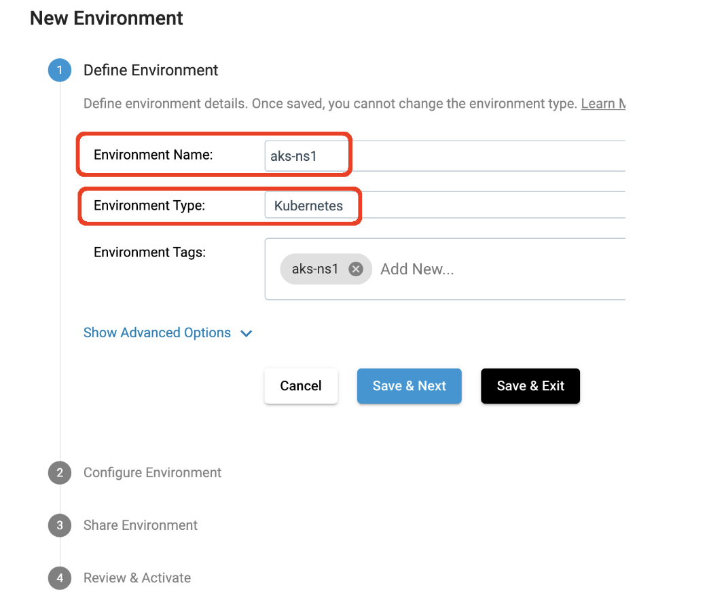

## StreamSets SDK Kubernetes Deployment Example with Ingress

This project provides an example of how to use the [StreamSets Platform SDK](https://docs.streamsets.com/platform-sdk/latest/index.html) to programmatically create a [Kubernetes Deployment](https://docs.streamsets.com/portal/platform-controlhub/controlhub/UserGuide/Deployments/Kubernetes.html#concept_ec3_cqg_hvb) of [Data Collector](https://streamsets.com/products/data-collector-engine/) (SDC) using an Advanced Kubernetes configuration (as described in Step 2 [here](https://docs.streamsets.com/portal/platform-controlhub/controlhub/UserGuide/Deployments/Kubernetes.html#task_xvp_g1n_jvb)) that includes a Kubernetes Service and Ingress, with HTTPS-based access to the deployed Data Collectors.  This approach may be necessary if [Direct REST APIs](https://docs.streamsets.com/portal/platform-controlhub/controlhub/UserGuide/Engines/Communication.html#concept_dt2_hq3_34b) must be used rather than [WebSocket Tunneling](https://docs.streamsets.com/portal/platform-controlhub/controlhub/UserGuide/Engines/Communication.html#concept_hbg_fq3_34b).

### Prerequisites

- The StreamSets Organization should have WebSocket communication disabled

- An existing Kubernetes cluster with the ability to deploy an Ingress Controller. For this example I will use [ingress-nginx](https://kubernetes.github.io/ingress-nginx/deploy/) on Azure Kubernetes Service (AKS)

### Configuration Details

- This example assumes TLS will be terminated at the Load Balancer with backend communication to SDC Pods over http.  The example could easily be extended to support backend communication to SDC over https

- A custom https URL will be set in the engine's <code>sdc.base.http.url</code> property

- The engine's <code>http.enable.forwarded.requests</code> property will be set to <code>true</code>

- A Kubernetes Service and Ingress will be created for the Data Collector deployment

- Path-based routing will be configured for the Ingress

### Test Environment

- AKS using Kubernetes version v1.25.11 

- ingress-nginx version 1.6.4

- SDC version 5.6.0

### Create a Namespace for the StreamSets Deployments

Create a namespace for the StreamSets Deployment:

<code>$ kubectl create ns ns1</code>

Make that namespace the default:

<code>$ kubectl config set-context --current --namespace ns1</code>

### Deploy the Ingress Controller

I installed ingress-nginx v1.6.4 on AKS using the command:

<code>$ kubectl apply -f https://raw.githubusercontent.com/kubernetes/ingress-nginx/controller-v1.6.4/deploy/static/provider/cloud/deploy.yaml</code>

### Get the External IP for the Ingress Controller's Load Balancer Service

### Map a DNS Name to the Load Balancer's IP
I added a record to my DNS to map the name <code>aks.onefoursix.com</code> to the Load Balancer's external IP, and confirm that using nslookup:

	$  nslookup aks.onefoursix.com
	Server:	8.8.8.8
	Address:	8.8.8.8#53

	Non-authoritative answer:
	Name:	aks.onefoursix.com
	Address: 20.69.83.54

### Store a TLS key and cert for the Load Balancer in a Secret
I'll use a wildcard cert and key for <code>*.onefoursix.com</code> in the files tls.crt and tls.key respectively. Store the TLS key and cert in a Kubernetes Secret:

	$ kubectl create secret tls streamsets-tls \
    	--key ~/certs/tls.key --cert ~/certs/tls.crt

### Create a Kubernetes Environment

I'll create a new Kubernetes Environment named aks-ns1:

